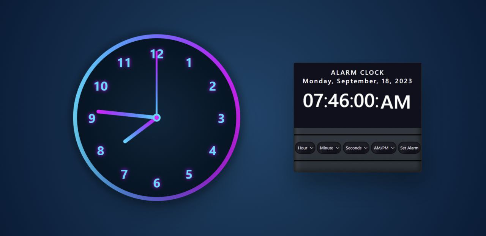

# Project-AlarmClock
Set alarms effortlessly and never miss a beat with web-based alarm clock

# Alarm-Clock using Vanilla JavaScript

<li>This is a repository for Alarm Clock Developed using Vanilla JavaScript, HTML, CSS.</li>
 
<li> It is developed to elevate mornings with serene simplicity and powerful functionality.</li>
 

/--------------------------------------------------------------------------------------------------------------------------------/

# PRODUCT DEMO

[Alarm-Clock]    

# LINKS

<a href = "https://aniruddh-joshi.github.io/Project-AlarmClock/"> <b>LIVE PRODUCT</b> </a>  &nbsp; <a href = "https://github.com/aniruddh-joshi/Project-AlarmClock"> <b>CODE</b> </a>  

--------------------------------------------------------------------------------------------------------------------------------------------------------
 
<strong>Connect With Me @</strong>

